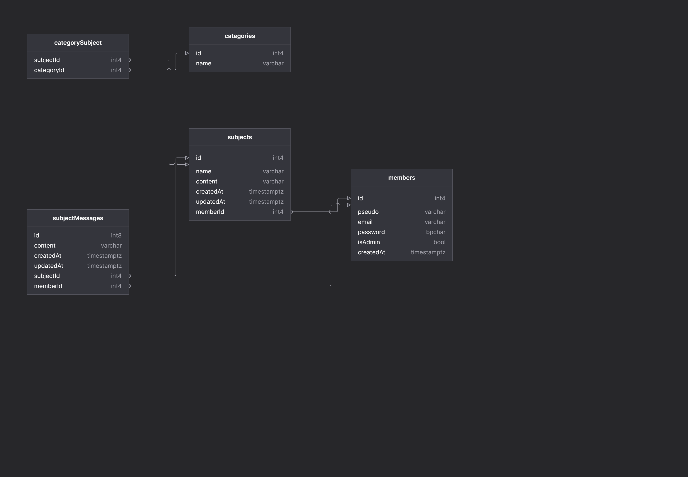

# UNAMUR - FORUM API

Stackoverflow like API

## Models

### Category

- Seul les membres admin peuvent créer une catégories
- Le nom de la catégorie est unique
- Exemple de catégory => (JS, C#, Java, Python, COBOL)

###  Subject

- Seul les membres connecté peuvent créer un sujet.
- Un sujet possède plusieurs catégories et inversement plusieurs category peuvent être associé à plusieurs sujets.

### Message

- Seul les membres connecté peuvent laisser des messages sur les sujets
- Un message est associé à un auteur et un sujets

### Member

- Un membre est soit un admin ou un membre normal
- Il pourra se connecter grâce à son pseudo ou son email
- Son mot de passe sera composé d'au minimum 8 caractères, contenant une majuscule, un chiffre et un caractères spéciales
